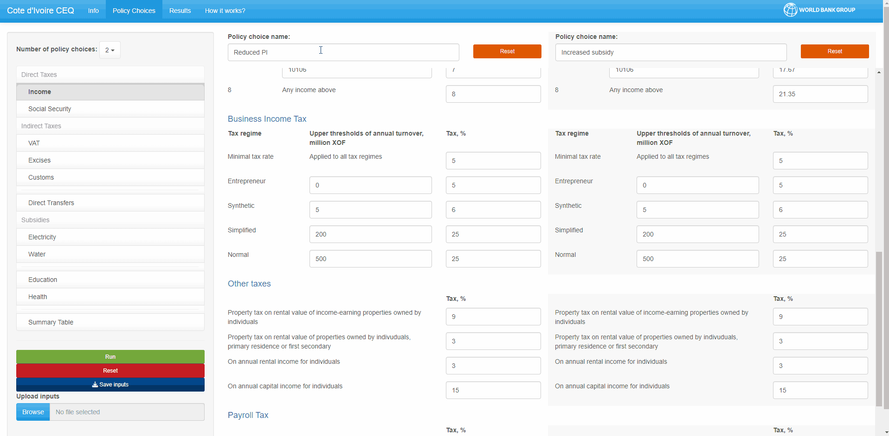

# **devCEQ**: Development platform for Shiny fiscal microsimulations

This R package contains standardized infrastructure for developing and deploying country-specific fiscal microsimulations as Shiny apps for the Poverty and Equity Policy Lab. The main goal of these apps is to provide users with the visual interface for executing complex microsimulations, and summarizing their results. 

There are several apps deployed using the **devCEQ** infrastructure: [Senegal CEQ 2018](https://datanalytics.worldbank.org/senceqapp2018/), [Côte d'Ivoire CEQ](https://datanalytics.worldbank.org/civCEQapp/), [Benin CEQ](https://datanalytics.worldbank.org/benCEQapp/), [Indonesia CEQ](https://datanalytics.worldbank.org/idnCEQ2019/). The **devCEQ** package evolved as a result of developing independent apps for [Armenia v1](https://datanalytics.worldbank.org/armCEQapp/) and [Armenia v2](https://datanalytics.worldbank.org/armenia-ceq/), [El Salvador](https://datanalytics.worldbank.org/el-salvador-fiscal-and-equity-tool/), [Turkey](https://datanalytics.worldbank.org/turkey-tax-simulation-tool/), and [Romania CEQ](https://datanalytics.worldbank.org/romania-sim-tool/), where various aspects and requirements to the application were tested at first.

Esentially, **devCEQ** R Package standardizes the data flow of the microsimulaiton and wraps it in a users interface. With this package, developers can customize the input page. Develop and embed any data and simulation methodology at the core of the microsimulation. Recicle output visualizaation modules or develop own components to better communicate the results. 

An example of such app is below.



## Getting started

### Pre-requisites

1.  It is expected that everyone is familiar with Stata, can independently run CEQ-like microsimulations in Stata and change code in order to save different stages of the microsimulation analysis.

2.  Install the latest versions of [R](https://cran.r-project.org/bin/windows/base/), [Rtools](https://cran.r-project.org/bin/windows/Rtools/rtools43/rtools.html), and [R Studio](https://posit.co/download/rstudio-desktop/).

3.  Install [GitHub Desktop](https://desktop.github.com/) and familiarize with the basics of workflow using Git and Github.

### Install `devCEQ` package 

This is very important as this package is the backbone of microsimulation analysis. To install it, run in the console:

```r
if (!require("remotes")) {
  install.packages("remotes")
}
remotes::install_github("wbEPL/devCEQ", dependencies = TRUE, build_vignettes = FALSE)
```

### Run an examplary app

Now, to launch the exemplary micro simulation app, run the following command:

```r

```

## The process of developing a microsimulation

This guide/website is meant to equip users with the key skills they need for developing the user interface of the microsimulation tools in R Shiny. Follow tutorials in the consecutive order under the [Articles](https://wbepl.github.io/devCEQ/articles/index.html) above. Limited functional documentation is also available in [References](https://wbepl.github.io/devCEQ/reference/index.html). 

Overall, the process of microsimulation development consists of **two broad stages**:

1.  Developing a microsimulation in Stata (with Excel for data input/output) and polishing the simulation methodology to the dissemination-ready state.

2.  'Translating' the final Stata microsimulation into R, optimizing the analysis, and building a Shiny dashboard around it.

The first stage is not described here in detail, however, the article [Microsmiulations in Stata](https://wbepl.github.io/devCEQ/articles/microsim-stata.Rmd) contains some best practices for developing such microsimulations in Stata. Users are advised to follow examples from this script in order to set up properly the workflow of translating the microsimulation from Stata to R.

On the second stage, translation from Stata to R is happening and the App is being created. This translation process has few logical steps outlined below. A number of articles is developed for each step. Please follow them to familiarize with the translation process.

1.  Converting simulation methodology from Stata to R.

    1.  Running a microsimulation in Stata
    2.  Setting up a workflow in R
    3.  Re-saving pre-simulation data in R
    4.  Translating Stata code to R and comparing results between R and Stata
    5.  Automating inputs provision in R
    
2.  Designing the input page of the dashboard.

    1.  Building inputs strucutre table.
    2.  Advanced topics: inputs in sub-tables.

3.  Designing the output page (visualization page) of the dashboard.

    1.  Defining key variables used in output building
    2.  Using Stata inputs to build a moc-up visualisation page
    3.  Advances topics: customizing outputs visualization
    
4.  Integrating the input page, output page, and simulation logit in a single dashboard.

<!-- 5.  Troubleshooting and improving the analysis. -->


